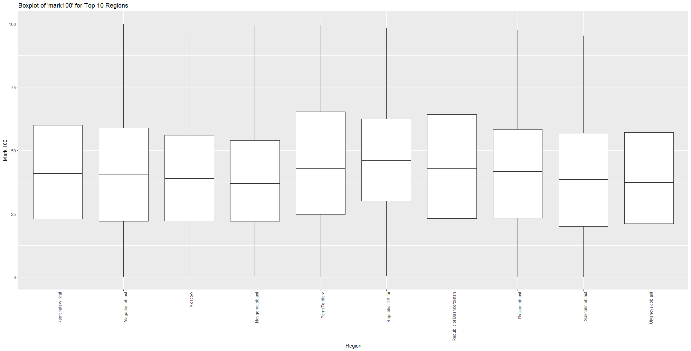
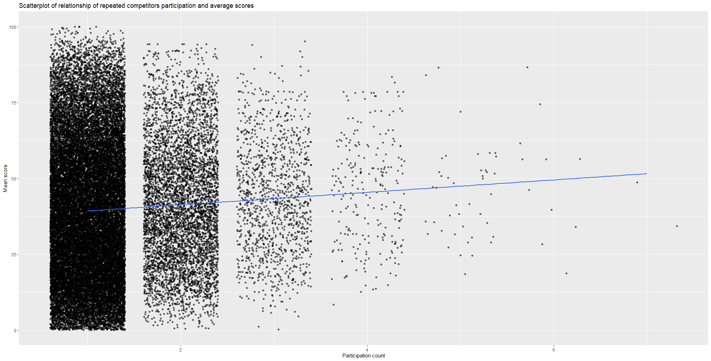
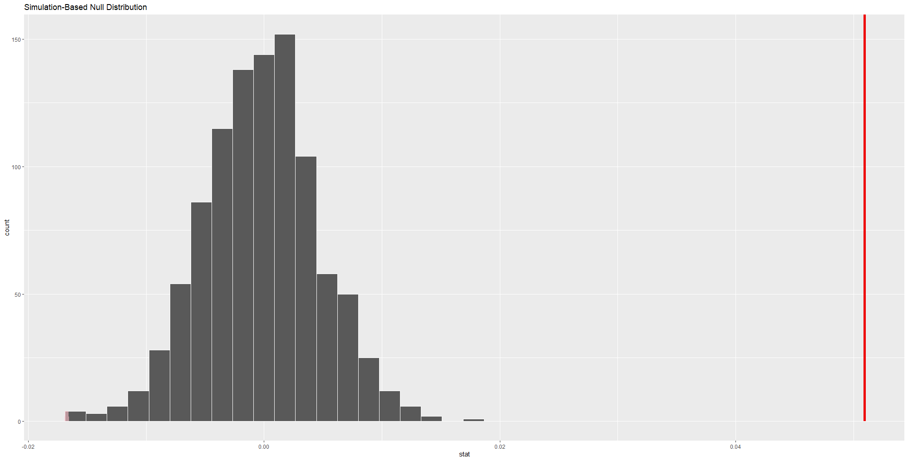
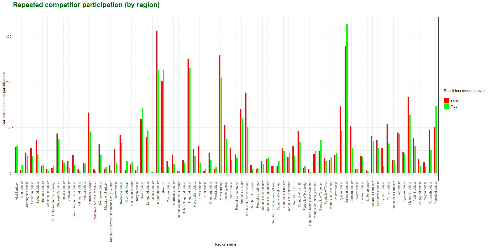
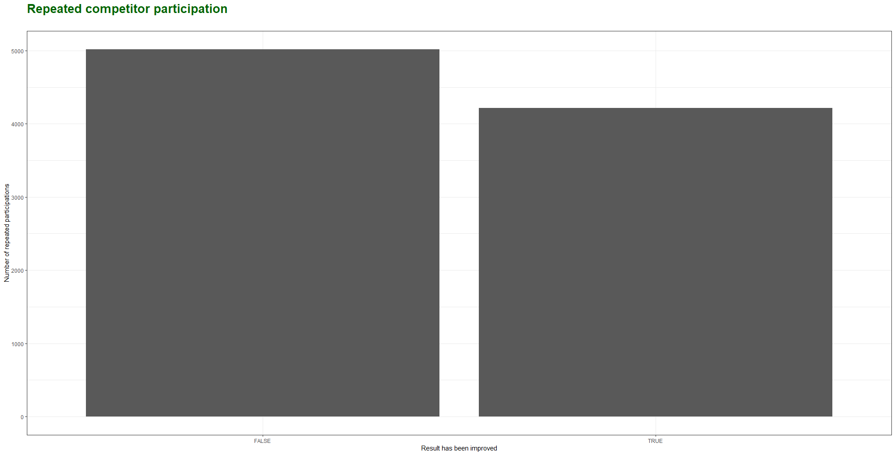
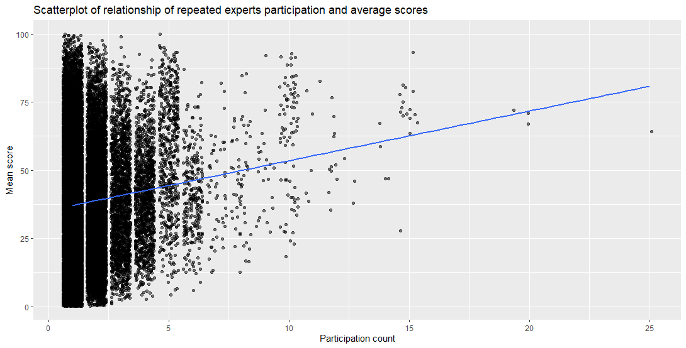
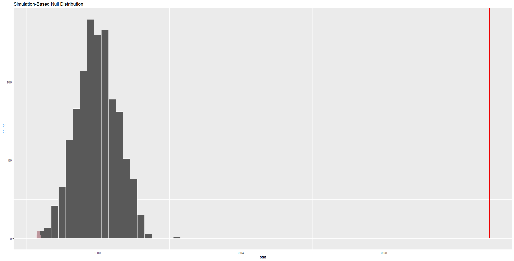
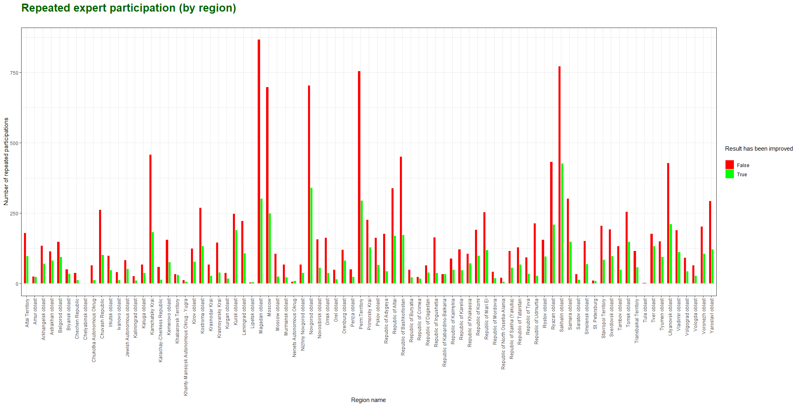
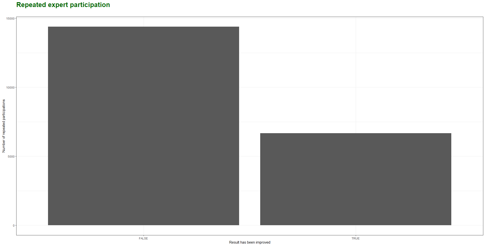

## Preface
<!-- Optional, the preface is not about the subject -->
An analysis of WorldSkills Russia 
competition events  

By  Aleksandr Gorbachev & David Langeveld  


A Research Paper  
Submitted to the lecturer of the subject ‘Programming with R’  
The Hague University of Applied Sciences PRO  
Master of Business Administration  
MBA Big Data Analytics  
November 2023

## Abstract
<!-- Contains the purpose of the research carried out, the research questions that are dealt with, the research method and the most important findings -->

## Table of contents

## Introduction
<!-- An introductory chapter in which the purpose and design of the (sub)study is explained and in which the research questions are described -->

[WorldSkills International](https://worldskills.org/) is a global organization dedicated to promoting excellence in vocational and technical education. It brings together young professionals from around the world to compete in skill-based competitions that showcase their talents and expertise in a wide range of fields, from engineering and technology to hospitality and creative arts. These competitions are assessed by a panel of expert judges who rigorously evaluate participants' performance, measuring their precision, creativity, and adherence to international industry standards.

[WorldSkills Russia](https://worldskills.ru/) as a member organization is in charge to govern and oversee that national and regional competition events comply with WorldSkills International standards as well as for collecting and aggregating results countrywide.

Current research is targeted to explore and analyze data from WorldSkills Russia competition events to answer following questions:

- Does repeated participation in competitions have a positive effect on a competitor's average score?
- Does the repeated participation of a compatriot expert have a positive effect on the average results of his/her compatriot competitors?

These questions are formulated as followed:

1. Impact of repeated participation on competitor's average score.

    - _null hypothesis (h0): The repeated participation in WorldSkills Russia competitions does not improve a competitor's average score._   

    - _alternative hypothesis (h1): The repeated participation in WorldSkills Russia competitions improves a competitor's average score._

2. Effect of repeated participation of a compatriot expert on competitor results

    - _null hypothesis (h0): The repeated participation of a compatriot expert in WorldSkills Russia competitions does not improve his/her competitor's (average) results._  

   - _alternative hypothesis (h1): The repeated participation of a compatriot expert in WorldSkills Russia competitions improves his/her compatriot competitor's average results._

## Operationalization of the research questions
<!-- Describe the data that will be used and how the questions will be answered on the basis of this data. The data analysis itself is not yet described here. So do tell ‘Data file [X] comes from [Y] and can answer the posed questions because [Z]’, but do not yet describe the data itself -->

Each competition event uses the Competition Information System (CIS) to record competition results. A separate instance of CIS is used for each event, so all event results are stored in a separate database instance. In order to have an overview of all competition events, WorldSkills Russia has developed its own aggregation system called Electronic System for Internet Monitoring (eSIM).

The raw data used for this research was kindly provided by the **autonomous non-profit organization "Agency for the Development of Professional Excellence (WorldSkills Russia)"** and is essentially a dump from the eSIM database, specifically from the competition results table. Therefore, the observation unit is a skills competition result for a given competitor for a given competition event.

The following steps will make sure to operationalize the data so that the research questions that are formulated will be answered:

- Data import and preparation

- Initial exploratory data analysis and summary statistics 

- Build linear regression models and null hypotheses for both research questions

These steps make sure the dataset is understandable, cleaned and prepared for exploration so the communication regarding the key results can be done to a broad audience.  
   
### Matching provided data with posed questions

This dataset can be used to perform statistical analyses that will help provide evidence and insights into the impact of various factors on competitors' performance and whether these effects are statistically significant. To create a linear regression model based on the research questions, it is necessary to identify an outcome (dependent) variable and predictor (independent) variable(s) for each question.  

In mathematical terms this will form an equation, _Y = a + bX_, where _Y_ is the outcome variable, _X_ will be the predictor, _a_ represents the intercept and _bX_ represents the slope associated with the predictor variable.

#### Does repeated participation in competitions have a positive effect on a competitor's average score?

WorldSkills Russia has different levels for local WorldSkills competitions:

- Regional competitions among regional colleges
- National competitions among regions
- University competitions for students of given university
- National inter-university competitions
- HiTech competition among employees of companies in industrial sector
- DigitalSkills competition among college students, university students and employees companies in IT sector

So there may be a case where a given competitor participates in a sequence of competitions at different levels (e.g. Regional, National, HiTech, DigitalSkills) or may be a guest competitor in other regional competitions (usually when preparing for National). It's reasonable to assume that the average score of such a competitor should improve each time he/she participates in the next competition.

To address this question, we can analyze the performance of competitors who have participated in multiple competitions over time. Group competitors into categories based on the number of competitions they've entered and calculate their average scores for each category. Then, use statistical tests or regression analysis to determine if there is a an improvement in scores with repeated participation.  

- Outcome Variable: Competitor's average score over multiple competitions.  

- Predictor Variable: Competitor's number of repetitions in the competition (number of results).

#### Does the repeated participation of a compatriot expert have a positive effect on the average results of his/her compatriot competitors?

It's often the case that a particular region has the same designated expert for a particular skill competition, who represents the region at nationals. It's reasonable to assume that, in this case, the preparation methodology of his compatriot competitors should improve over time, and thus the result of an average competitor should tend to improve over time as well.

To explore this, we can group competitors by the presence of a compatriot expert and analyze the average performance of their compatriot competitors in each group. Statistical tests or regression analysis can help assess if the repeated participation of a compatriot expert improves the average results of their compatriot competitors. 

- Outcome Variable: Competitor's average score over multiple competitions.

- Predictor Variable: Expert's number of repetitions in the competition (number of results).

#### Which condition has more significant impact on score improvement?

If there is a true positive correlation in both cases, we also would like to calculate the proportion of cases where scores were improved to see which condition have more significant impact on the average results.

## Description of the data used
<!-- Which data/variables were recorded/used for the study, something about any missing values, a graphical representation and summary statistics. Please note that this is about providing insight into the data used, not yet about (the method used for) answering the research questions -->

### Raw data sources

Raw data is provided as tree XLSX tables:

- participants100.xlsx
- participants200.xlsx
- participants300.xlsx

The total number of observations in the three participant spreadsheets is 600.000. Due to the nature of the SQL scheme, some columns refer to other tables (fk, foreign keys) and due to local regulations, some of the related data (e.g. personal data such as competitor or expert name, age, gender, etc.) is not available for cross-border transfer, storage or processing.

Below is a table with the name and description of the original variables, an indication of whether the variable will be used in the final dataset and an indication of the new name (if applicable): 

|Variable name|Renamed to|Comment from owner|Will be used|
|---|---|---|---|
|**pk_participant**|result|ID of competition result record (primary key)|Yes|
|**fkUsers**|competitor|competitor reference (foreign key)|Yes|
|**fkChamp**|competition|competition event reference (foreign key)|Yes|
|**fkComp**|skill|skill trade reference (foreign key)|Yes|
|**ChampRole**|-|ID of the participant's role at the competition |No|
|**regionID**|region|code of participant's region origin (foreign key) |Yes|
|**mark100**|mark100|100-point scale|Yes|
|**mark500**|mark500|500-point scale|Yes|
|**medal**|medal|type of medal awarded|Yes|
|**timestamp**|timestamp|time when the result was locked in the system |Yes|
|**fkUserAdd**|-|User ID of the user who added the result to the system (foreign key)|No|
|**competitorMarker**|-|marker for group competition|No|
|**expertGroupMarker**|-|marker for specific expert group|No|
|**excludeFromResault**|-|marker for "out of contest" result |No|
|**fk_quotaCategory**|-|quota category for the competition (foreign key)|No|
|**fk_command**|team|reference for a team membership (foreign key)|Yes|
|**FK_USER_CP**|-|user ID in the digital platform (foreign key)|No|
|**ACCESS_RKC**|-|whether the regional competition center has access to the record|No|
|**FK_COMPATRIOT**|expert|reference for compatriot expert ID (foreign key)|Yes|
|**organization**|-|organization represented by the participant|No|
|**nok**|-|participation in an independent qualification assessment project (for demonstration exams)|No|
|**participant_updated_at**|-|time of last record update|No|
|**is_requested**|-|field for access in the business process|No|
|**is_accepted**|-|field for access in the business process|No|
|**mark700**|-|700-point scale|No|

To have more observability an additional data frame was handcrafted from open sources which matching region codes to their actaul names (regions.csv):
|Variable name|Comment|
|---|---|
|**code**|Code of region (primary key)
|**regionName**|Name of Region reference

Detailed data importing and preparation steps are noted in the Appendix 1 and in the included script.

After customizing original dataset we have a resulting dataframe with 12 variables and ```47 861``` unique results (~3,82% of original size):

```R
> glimpse(esim_data)
Rows: 47,861
Columns: 12
$ result      <dbl> 43053, 53048, 53053, 53054, 53057, 53059, 53060, 53064, 53065, 53066, 5~
$ competitor  <dbl> 36517, 23137, 15379, 18028, 18038, 23149, 15384, 18309, 18310, 16712, 2~
$ competition <dbl> 182, 322, 322, 322, 322, 322, 322, 349, 349, 349, 322, 322, 322, 322, 3~
$ skill       <dbl> 175, 183, 183, 183, 184, 184, 184, 185, 185, 185, 186, 186, 186, 186, 1~
$ region      <dbl> 54, 62, 70, 76, 76, 62, 70, 76, 76, 77, 26, 33, 70, 76, 62, 77, 77, 76,~
$ mark100     <dbl> 25.85, 64.60, 6.60, 10.90, 37.35, 30.85, 8.50, 22.60, 22.60, 7.90, 15.9~
$ mark500     <dbl> 549, 561, 461, 468, 507, 495, 456, 539, 539, 480, 479, 516, 469, 512, 5~
$ medal       <chr> "GOLD", "GOLD", NA, NA, "Medallion for Excellence", NA, NA, "SILVER", "~
$ timestamp   <chr> NA, NA, NA, NA, NA, NA, NA, NA, NA, NA, NA, NA, NA, NA, NA, NA, NA, NA,~
$ team        <dbl> 0, 0, 0, 0, 0, 0, 0, 0, 0, 0, 0, 0, 0, 0, 0, 0, 0, 0, 0, 430, 430, 0, 0~
$ expert      <dbl> 43413, 10956, 15382, 1562, 10758, 10949, 15380, 746, 746, 158, 11425, 4~
$ regionName  <chr> "Novosibirsk oblast", "Ryazan oblast", "Tomsk oblast", "Yaroslavl oblas~
```

Number of unique and missing values for each column is provided below:

```R
> data.frame(unique=sapply(esim_data, function(x) sum(length(unique(x, na.rm = TRUE)))),
+            missing=sapply(esim_data, function(x) sum(is.na(x) | x == 0)))

            unique missing
result       47861       0
competitor   38625       0
competition    514       0
skill          300       0
region         121       0
mark100       8419       0
mark500        186    2255
medal            5   21487
timestamp    37512    4017
team          4572   37782
expert       26805       0
regionName      86       0
```

### Data summary statistics

After we distinguished a relevant part of observations, the calculation of the summary statistics will be done for mark100 scores from a region point of view.

When analyzing the summary statistics where the top 10 regions in terms of mark100 scores, the following could be noted:  
- There are some outliers in 5 of the 10 regions, meaning they deviate a bit more from the bulk of the data. These outliers are data points (observations of results) that fall outside the typical range of the values of the dataset.
- The presence of these outliers can affect the interpretation of the boxplot. The whiskers of the boxplot extend to 1.5 times the interquartile range (IQR) beyond the first and third quartiles.
- The medians and interquartile ranges (IQR) in the boxplots are all relatively close to each other when compared against regions. It suggests that, on average, the central tendency of the scores (mark100) is similar across the top 10 regions. 

```R
summary_by_regionName <- esim_data %>%
  group_by(regionName) %>%
  summarise(
    count = n(),                       # Count of observations
    mean_mark100 = mean(mark100),      # Average of mark100
    median_mark100 = median(mark100),  # Median of mark100
    sd_mark100 = sd(mark100)) %>%      # Standard deviation of mark100
  arrange(desc(count))                 # most observations per region at the top

summary_by_regionName

# A tibble: 86 x 5
   regionName                count mean_mark100 median_mark100 sd_mark100
   <chr>                     <int>        <dbl>          <dbl>      <dbl>
 1 Magadan oblast             2671         41.3           40.7       23.4
 2 Sakhalin oblast            2441         39.7           38.5       23.0
 3 Novgorod oblast            2219         38.8           37.0       21.5
 4 Moscow                     2036         40.8           38.9       22.6
 5 Perm Territory             2018         45.7           43.0       25.0
 6 Republic of Bashkortostan  1464         44.3           42.9       25.3
 7 Kamchatsky Krai            1409         42.2           41.0       22.9
 8 Ryazan oblast              1388         41.8           41.8       22.2
 9 Ulyanovsk oblast           1299         40.6           37.4       23.6
10 Republic of Altai          1153         46.9           46.0       21.6
# i 76 more rows
```

We can also visualize this summary by filtering top 10 participation regions from original dataset and making a boxplot out of this dataframe.

```R
# Filter the top 10 regions in terms of observations (count)
top_regions <- esim_data %>%
  group_by(regionName) %>%
  summarise(count = n()) %>%
  top_n(10, wt = count) %>%
  pull(regionName)

# Filter the dataset for the top 10 regions
filtered_data_top10 <- esim_data %>% filter(regionName %in% top_regions)
    
# Create a boxplot to visualize 'mark100' for the top 10 regions
ggplot(filtered_data_top10, aes(x = as.factor(regionName), y = mark100)) +
  geom_boxplot() +
  labs(title = "Boxplot of 'mark100' for Top 10 Regions",
       x = "Region",
       y = "Mark 100") +
  theme(axis.text.x = element_text(angle = 90, hjust = 1))
```



As we can see, the avarage result from top 10 participating regions is not higher than 45 out of 100, and there is also a significant standard deviation that indicates that scores have a significant spread.

With these findings in mind, we can move on to the actual analysis of our research hypotheses.

## Results of the data analysis
<!-- Results of the data analysis: The actual answer of the research questions based on data analysis, the use of specific graphs to gain insight into the answers to the questions and the results of the hypothesis testing -->

### Relationship of repeated competitors participation and average scores 

Our first question is whether the repeated participation in competitions have a positive effect on a competitor's average score?

So first we would like to group results by competitors and regions and summarize the ``mark100`` variable to have a quick look at the outcome.

```R
# Grouping results by competitors and regions
cg <- esim_data %>% 
  group_by(competitor, region)  %>% 
  summarise(results = n(), 
            mean_score100 = mean(mark100), 
            max_score100 = max(mark100),
            min_score100 = min(mark100)) %>%
  arrange(desc(results)) 

# Quick look at the summary 
cg

# A tibble: 38,871 x 6
# Groups:   competitor [38,625]
   competitor region results mean_score100 max_score100 min_score100
        <dbl>  <dbl>   <int>         <dbl>        <dbl>        <dbl>
 1     101215     65       7          48.7         88.0        29.1 
 2     106308     53       7          34.2         48.3        12.2 
 3      75717     65       6          28.4         51.3        12.8 
 4      82474     76       6          18.7         31.7         9.85
 5      98028     81       6          74.4         94.8        20   
 6     103102     65       6          34.1         93.4         3.04
 7     106341     53       6          56.5         95.6        20   
 8     106381     53       6          61.6         79.0        35.0 
 9     106959     59       6          86.6         95.8        66.9 
10    1041592     76       6          39.7         60.4        16.2 
# i 38,861 more rows
```

We find that competitors who have participated multiple times have a significant difference in minimum and maximum scores. However, the range is also significant, and it's not necessarily the case that each next result is better than the previous.

Next, we will plot a simple linear regression to get a first idea of whether repeated participation has any effect on average scores.

```R
# Plotting the linear regression between participation count and mean average score 
cg %>% ggplot(aes(x = results, y = mean_score100)) +
  geom_jitter(alpha = 0.5) +
  labs(x = "Participation count", 
       y = "Mean score",
       title = "Scatterplot of relationship of repeated competitors participation and average scores") + 
  geom_smooth(method = "lm", se = FALSE)
```



Here we can spot weak but positive correlation between repeated competitors participation and average scores improvement.

For better understanding of this relationship we can build a regression model.

```R
# Fit regression model
c_model <- lm(mean_score100 ~ results, data = cg)

# Get regression table
get_regression_table(c_model)

# A tibble: 2 x 7
  term      estimate std_error statistic p_value lower_ci upper_ci
  <chr>        <dbl>     <dbl>     <dbl>   <dbl>    <dbl>    <dbl>
1 intercept    37.2      0.275     135.        0    36.7     37.7 
2 results       2.05     0.204      10.1       0     1.65     2.45
```

From this regression table, we can conclude that each time a competitor participates, his or her mark100 score improves by an average of 2.05 points.

To answer a formal question we also can build a null distibution and see how our actual observations fit into the Null Hypothesis:

```R
# Building Null Distribution
null_distribution_q1 <- cg %>% 
  specify(formula = mean_score100 ~ results) %>% 
  hypothesize(null = "independence") %>% 
  generate(reps = 1000, type = "permute") %>% 
  calculate(stat = "correlation")

# Observation difference proportion
obs_diff_prop_q1  <- cg %>% 
  specify(formula = mean_score100 ~ results) %>%
  calculate(stat = "correlation")

obs_diff_prop_q1

Response: mean_score100 (numeric)
Explanatory: results (numeric)
# A tibble: 1 x 1
    stat
   <dbl>
1 0.0509

# Visualizing null distribution
visualize(null_distribution_q1, bins = 20) + 
  shade_p_value(obs_stat = obs_diff_prop_q1, direction = "both")
```



In the resulting plot, the solid dark line marks 0.0509 = 5.09%, which is the probability of obtaining a test statistic just as or more extreme than the observed test statistic assuming the null hypothesis H0 is true.

In other words, we see that the value of the correlation between the average results and the number of times of participation in competitions, which we obtained, does not fit the hypothetical null distribution, where the average result does not correlate with the number of times of participation in competitions. Hence, we would be inclined to reject H0 and accept the alternative hypotesis the repetitive participation indeed have a positive impact on avarage score. 

Nevertheless, we would like see how often this is the case in general and in the context of different regions. To accomplish this we will 

- draw only results with repetitive participation;
- go over each result and check whether the absolute score is better (higher) than the previous one.

```R
# Framing a table with frequency of competitor IDs
n_occur <- data.frame(table(esim_data$competitor))

# Sub-setting results with only those competitor IDs who participated more than 1 time
comp_repeat <- esim_data %>% filter(competitor %in% n_occur[n_occur$Freq > 1, ]$Var1)

# Ordering data frame by competitor ID and then by result ID
comp_repeat <- comp_repeat[with(comp_repeat, order(competitor, result)), ]

# Adding a column and computing the boolean value whether each next result is higher than previous (absolute score)
# If this is a first result of a given competitor, value is NA
# If this is not first result of a given competitor, and mark100 value is higher than previous mark100 value, than value is TRUE
# If this is not first result of a given competitor, and mark100 value is lower than previous mark100 value, than value is FALSE
comp_repeat$improve100 <- with(comp_repeat, 
                            ifelse(competitor == lag(competitor), 
                                   ifelse(mark100 > lag(mark100), TRUE, FALSE), NA))

# Ploting geom bar grouping repeated competitor participation cases by region
# with exclusion of each first result (NA values)
comp_repeat %>% filter(!is.na(improve100)) %>% 
  ggplot(mapping = aes(x = factor(regionName),fill = factor(improve100) )) + 
  geom_bar(width = 0.5, position = position_dodge(width = 0.6)) +
  labs(title = "Repeated competitor participation (by region)\n", x = "Region name", y = "Number of repeated participations", fill = "Result has been improved\n") +
  scale_fill_manual(labels = c("False", "True"), values = c("red", "green")) +
  theme_bw() +
  theme(axis.text.x = element_text(angle = 90, vjust = 0.5, hjust=1),
        plot.title = element_text(size = 20, face = "bold", color = "darkgreen"))
```



Indeed we see that repetitive participation have some posotive impact on absolute score but generally ratio is not clear, so we will plot a general ratio as well.

```R
# Ploting summary geom bar 
# with exclusion of each first result (NA values)
comp_repeat %>% filter(!is.na(improve100)) %>%  
  ggplot(mapping = aes(x = improve100)) + 
  geom_bar() +
  labs(title = "Repeated competitor participation\n", x = "Result has been improved", y = "Number of repeated participations") +
  theme_bw() +
  theme(plot.title = element_text(size = 20, face = "bold", color = "darkgreen"))  
```



So now we see that even repeated participation have a positive impact on avarage score improvement, the number of absolute score improvement cases is less than number of cases when absolute scores were worsen.

### Relationship of repeated experts participation and average scores 

Our second question is whether the repeated participation of a compatriot expert have a positive effect on the average results of his/her compatriot competitors?

To figure this out we will likewise group results by experts and regions and summarize the mark100 variable to have a quick look at the outcome.

```R
# Grouping results by competitors and regions
eg <- esim_data %>% 
  group_by(expert, region)  %>% 
  summarise(results = n(), 
            mean_score100 = mean(mark100), 
            max_score100 = max(mark100),
            min_score100 = min(mark100)) %>%
  arrange(desc(results)) 

# Quick look at the summary 
eg

# A tibble: 27,205 x 6
# Groups:   expert [26,805]
   expert region results mean_score100 max_score100 min_score100
    <dbl>  <dbl>   <int>         <dbl>        <dbl>        <dbl>
 1  25211     45      25          64.3         81.8        29.3 
 2  62816     26      20          67.0         85.4        53.4 
 3 106634     65      20          70.8         95.2        50.3 
 4  77970     49      19          72.0         85.4        58.4 
 5  18238     76      15          70.5         87.4        36.8 
 6  25683     16      15          75.1         85.3        56.9 
 7  30547      2      15          79.0         80.5        76   
 8  43014     65      15          27.7         54.8         4.51
 9  62196     62      15          69.9         86.5        58.6 
10  94088      6      15          69.0         81.5        55.4 
# i 27,195 more rows
```

The main difference that we can conlude from this summary is that experts have higher avarage scores rates during their repetitive participation than we saw previously from the competitors prospective.

Next, we will plot a simple linear regression to get a first idea of whether repeated participation of experts has any effect on average scores.

```R
# Plotting the linear regression between expert participation count and mean average score 
eg %>% ggplot(aes(x = results, y = mean_score100)) +
  geom_jitter(alpha = 0.5) +
  labs(x = "Participation count", 
       y = "Mean score",
       title = "Scatterplot of relationship of repeated experts participation and average scores") + 
  geom_smooth(method = "lm", se = FALSE)
```



We can also notice a higher positive correlation of avarage scores and repetitive participation of experts.

Next we will build a regression model and check the regression table:

```R
# Fit regression model
e_model <- lm(mean_score100 ~ results, data = eg)

# Get regression table
get_regression_table(e_model)

# A tibble: 2 x 7
  term      estimate std_error statistic p_value lower_ci upper_ci
  <chr>        <dbl>     <dbl>     <dbl>   <dbl>    <dbl>    <dbl>
1 intercept    35.3       0.22     161.        0    34.8     35.7 
2 results       1.82      0.1       18.2       0     1.62     2.02
```

From this regression table, we can conclude that each time a expert participates, his or her compatriot competitor mark100 score improves by an average of 1.82 points, which is lower than we saw from previous regression table (2.05).

To answer a formal question we also can build a null distibution and see how our actual observations fit into the Null Hypothesis:

```R
# Building Null Distribution
null_distribution_q2 <- eg %>% 
  specify(formula = mean_score100 ~ results) %>% 
  hypothesize(null = "independence") %>% 
  generate(reps = 1000, type = "permute") %>% 
  calculate(stat = "correlation")

# Observation difference proportion
obs_diff_prop_q2  <- eg %>% 
  specify(formula = mean_score100 ~ results) %>%
  calculate(stat = "correlation")

obs_diff_prop_q2

Response: mean_score100 (numeric)
Explanatory: results (numeric)
# A tibble: 1 x 1
   stat
  <dbl>
1 0.109

# Visualizing null distribution
visualize(null_distribution_q2, bins = 20) + 
  shade_p_value(obs_stat = obs_diff_prop_q2, direction = "both")
```



In the resulting plot, the solid dark line marks 0.109 = 10.9%, which is the probability of obtaining a test statistic just as or more extreme than the observed test statistic assuming the null hypothesis H0 is true.

In other words, we see that the value of the correlation between the average scores and the number of times of compatriot expert participation in competitions, which we obtained, does not fit the hypothetical null distribution, where the average result does not correlate with the number of times of expert participation in competitions. Hence, we would be inclined to reject H0 and accept the alternative hypotesis the repetitive expert participation indeed have a positive impact on avarage score. 

Nevertheless, we would like see how often this is the case in general and in the context of different regions. To accomplish this we likewise

- draw only results with repetitive expert participation;
- go over each result and check whether the absolute score is better (higher) than the previous one.

```R
# Framing a table with frequency of experts IDs
e_occur <- data.frame(table(esim_data$expert))

# Subsetting results with only those expert IDs who participated more than 1 time
expert_repeat <- esim_data %>% filter(expert %in% e_occur[e_occur$Freq > 1, ]$Var1)

# Ordering data frame by expert ID and then by result ID
expert_repeat <- expert_repeat[with(expert_repeat, order(expert, result)), ]

# Adding a column and computing the boolean value whether each next result is higher than previous
# If this is a first result of a given expert (compatriot competitor), value is NA
# If this is not first result of a given expert (compatriot competitor), and mark100 value is higher than previous mark100 value, than value is TRUE
# If this is not first result of a given expert (compatriot competitor), and mark100 value is lower than previous mark100 value, than value is FALSE
expert_repeat$improve100 <- with(expert_repeat, ifelse(expert == lag(expert), ifelse(mark100 > lag(mark100), TRUE, FALSE), NA))

# Ploting geom bar grouping repeated expert participation cases by region
# with exclusion of each first result (NA values)
expert_repeat %>% filter(!is.na(improve100)) %>% 
  ggplot(mapping = aes(x = factor(regionName),fill = factor(improve100) )) + 
  geom_bar(width = 0.5, position = position_dodge(width = 0.6)) +
  labs(title = "Repeated expert participation (by region)\n", x = "Region name", y = "Number of repeated participations", fill = "Result has been improved\n") +
  scale_fill_manual(labels = c("False", "True"), values = c("red", "green")) +
  theme_bw() +
  theme(axis.text.x = element_text(angle = 90, vjust = 0.5, hjust=1),
        plot.title = element_text(size = 20, face = "bold", color = "darkgreen"))
```



As we see from the plot, speaking of absolute score improvement is even rare case than we saw during competitors repetitive participation.

We can clearly show that with the plot of general ratio:

```R
# Ploting geom bar with exclusion of each first result (NA values)
expert_repeat %>% filter(!is.na(improve100)) %>% 
  ggplot(mapping = aes(x = improve100)) + 
  geom_bar() +
  labs(title = "Repeated expert participation\n", x = "Result has been improved", y = "Number of repeated participations") +
  theme_bw() +
  theme(plot.title = element_text(size = 20, face = "bold", color = "darkgreen"))  
```



Here we can conclude that even repeated expert participation have a positive impact on avarage score improvement, the number of absolute score improvement cases is less than number of cases when absolute scores were worsen.

#### Which condition has more significant impact on score improvement?

By comparing ratios of absolute score improvement cases we can see that repetitive participation of given competitor have more significant impact (0.457) than repetitive participation of expert (0.316).

```R
# Summarizing proportions for competitors repetitive participation
comp_repeat %>% filter(!is.na(improve100)) %>%
  group_by(improve100) %>%
  summarise(n = n()) %>%
  mutate(freq = n / sum(n)) 

# A tibble: 2 x 3
  improve100     n  freq
  <lgl>      <int> <dbl>
1 FALSE       5018 0.543
2 TRUE        4218 0.457

# Summarizing proportions for expert repetitive participation
expert_repeat %>% filter(!is.na(improve100)) %>%
  group_by(improve100) %>%
  summarise(n = n()) %>%
  mutate(freq = n / sum(n)) 

# A tibble: 2 x 3
  improve100     n  freq
  <lgl>      <int> <dbl>
1 FALSE      14393 0.684
2 TRUE        6663 0.316
```

## Conclusions and recommendations
<!-- including recommendations for further research -->
Summary statistics

The closeness of the medians implies that, on anverage, people in different regions perform similarly on the test. This could indicate a level of consistency in educational outcomes or test performance across the regions.

It can also suggest that the educational systems or teaching methods in the various regions are providing similar levels of education or that the quality of educaton is relatively consistent across the regions.  

The narrow spread of the median could also mean that the variability in test scores within the region is limited. In other words, there might not be significant differences in individual performance within a given region.  

The presence of outliers in 5 of the 10 regions, even if they don't impact the median in a relative matter against the other regions, may offer further understanding into specific scores of high performance.

The regions are not closely related in terms of location, but might share socioeconomic factors relative to each other. Factors like population income, demography, educational policies could give more sense regarding these relationships.

From the above mentioned research we also can conclude that both conditions, such as 

- repeated competitor participation in WorlSkills Russia competition
- repeated compatriot expert participation in WorlSkills Russia competition

have a positive impact on avarage scores of competitors (expert's compatriot compatitors).

Nevertheless, we also studied that number of known cases, when absolute scores were improved each next participation are lower than number of cases when absolute scores were worsen.

Even though, comparing these conditions, we can also conclude that repetitive participation of a competitor have more significant impact on avarage score improvement.

Recomendations for future research mmay include:

- study of correlation between absolute scores and multiple factors toghether
- improvement of scores over time period
- comparison of mark500 scores between different competitions over time
- impact of team participation in scores improvement

## Brief description of the division of work
<!-- Who is responsible for which part of the report and script -->
The tasks regarding the report were divided between the two authors of this report, Aleksandr & David. 

Aleksandr Gorbachev: 
- Was responsible to getting the dataset from external suppliers related to his work
- Has industry domain knowledge and understood the concepts and structure of the supplied dataset
- Setup the initial draft of the research questions and script
- Performed parts of scripting for clean up and wrangling

David Langeveld:  
- Validated the initial draft and script by reviewing all steps taken, came up with suggestions and additions where necessary
- Wrote the initial draft of the research paper
- Implemented summary statistics and respective visualizations
- Performed parts of scripting for visualizations of respective hypothesis testing

## Appendix 1. Customizing the original dataset

The foremost step is to perform initial data analysis to spot useful variables and remove variables with inconsistent or useless values:

- take a brief look at the raw data
- transform dataset in the more convenient way for exploration purposes
- clean up observations which are missing important values for analysis

All data operations will be performed using [R language](https://posit.co/download/rstudio-desktop/). 

First we will load Excel tables into R, merge all tables in a single dataframe and look at columns.

```R
# Loading required libraries
library(readxl)
library(tidyverse)
library(readr)

# Loading excel sheets 
frame1 <- read_excel("Datafiles/participants100.xlsx")
frame2 <- read_excel("Datafiles/participants200.xlsx")
frame3 <- read_excel("Datafiles/participants300.xlsx")

# Merging all sheets into a single dataframe
esim_data <- rbind(frame1, frame2, frame3)

# Exploring dataframe columns
glimpse(esim_data)

Rows: 600,000
Columns: 25
$ pk_participant         <dbl> 5, 6, 7, 9, 10, 11, 12, 13, 22, 24, 25, 26, 28, 29, 37, 40, 42,~
$ fkUsers                <dbl> 84, 81, 79, 82, 85, 87, 86, 84, 81, 82, 84, 87, 79, 80, 79, 110~
$ fkChamp                <dbl> 7, 7, 7, 7, 4, 4, 4, 4, 8, 11, 11, 11, 13, 13, 12, 14, 20, 12, ~
$ fkComp                 <dbl> 164, 164, 187, 164, 164, 164, 164, 164, 176, 165, 166, 166, 166~
$ ChampRole              <dbl> 4, 4, 4, 5, 5, 5, 5, 5, 5, 5, 5, 5, 5, 4, 5, 4, 5, 5, 5, 5, 5, ~
$ regionID               <dbl> 76, 76, 76, 76, 76, 76, 76, 76, 76, 76, 76, 76, 76, 76, 76, 3, ~
$ mark100                <dbl> 0, 0, 0, 0, 0, 0, 0, 0, 0, 0, 0, 0, 0, 0, 0, 0, 0, 0, 0, 0, 0, ~
$ mark500                <dbl> 0, 0, 0, 0, 0, 0, 0, 0, 0, 0, 0, 0, 0, 0, 0, 0, 0, 0, 0, 0, 0, ~
$ medal                  <chr> NA, NA, NA, NA, NA, NA, NA, NA, NA, NA, NA, NA, NA, NA, NA, NA,~
$ timestamp              <chr> NA, NA, NA, NA, NA, NA, NA, NA, NA, NA, NA, NA, NA, NA, NA, NA,~
$ fkUserAdd              <dbl> 0, 0, 0, 0, 0, 0, 0, 0, 0, 0, 0, 0, 0, 0, 0, 0, 0, 0, 0, 0, 0, ~
$ competitorMarker       <lgl> NA, NA, NA, NA, NA, NA, NA, NA, NA, NA, NA, NA, NA, NA, NA, NA,~
$ expertGroupMarker      <chr> NA, NA, NA, NA, NA, NA, NA, NA, NA, NA, NA, NA, NA, NA, NA, NA,~
$ excludeFromResault     <chr> NA, NA, NA, NA, NA, NA, NA, NA, NA, NA, NA, NA, NA, NA, NA, NA,~
$ fk_quotaCategory       <dbl> 0, 0, 0, 0, 0, 0, 0, 0, 0, 0, 0, 0, 0, 0, 0, 0, 0, 0, 0, 0, 0, ~
$ fk_command             <dbl> 0, 0, 0, 0, 0, 0, 0, 0, 0, 0, 0, 0, 0, 0, 0, 0, 0, 0, 0, 0, 0, ~
$ FK_USER_CP             <dbl> 0, 0, 0, 0, 0, 0, 0, 0, 0, 0, 0, 0, 0, 0, 0, 0, 0, 0, 0, 0, 0, ~
$ ACCESS_RKC             <dbl> 0, 0, 0, 0, 0, 0, 0, 0, 0, 0, 0, 0, 0, 0, 0, 0, 0, 0, 0, 0, 0, ~
$ FK_COMPATRIOT          <dbl> 0, 0, 0, 0, 0, 0, 0, 0, 0, 0, 0, 0, 0, 0, 0, 0, 0, 0, 0, 0, 0, ~
$ organization           <lgl> NA, NA, NA, NA, NA, NA, NA, NA, NA, NA, NA, NA, NA, NA, NA, NA,~
$ nok                    <dbl> 0, 0, 0, 0, 0, 0, 0, 0, 0, 0, 0, 0, 0, 0, 0, 0, 0, 0, 0, 0, 0, ~
$ participant_updated_at <chr> "2020-12-07 11:50:38", "2020-12-07 11:50:38", "2020-12-07 11:50~
$ is_requested           <dbl> 0, 0, 0, 0, 0, 0, 0, 0, 0, 0, 0, 0, 0, 0, 0, 0, 0, 0, 0, 0, 0, ~
$ is_accepted            <dbl> 0, 0, 0, 0, 0, 0, 0, 0, 0, 0, 0, 0, 0, 0, 0, 0, 0, 0, 0, 0, 0, ~
$ mark700                <lgl> NA, NA, NA, NA, NA, NA, NA, NA, NA, NA, NA, NA, NA, NA, NA, NA,~
```
Exploration of the dataframes through the use of the _glimpse_ function is employed to retrieve metadata (data about data) into the contents of the data frame under consideration in this paper. 

As we see, there are 600 000 observations and 25 columns total. There are many 0s and NA values at the first glance. 

Let's take a random sample of 20 rows.

```R
# Taking random 20 rows sample
sample <- esim_data[sample(nrow(esim_data), 20), ]
sample
# A tibble: 20 x 25
   pk_participant fkUsers fkChamp fkComp ChampRole regionID mark100 mark500 medal      timestamp
            <dbl>   <dbl>   <dbl>  <dbl>     <dbl>    <dbl>   <dbl>   <dbl> <chr>      <chr>    
 1         454464 1187314   13980    341         4       68    NA        NA NA         2019-11-~
 2         284414  122757    5471    203         4       49    NA        NA NA         2019-03-~
 3         412062 1133052    8831    186         5       76    11.6     455 NA         2019-06-~
 4          30299   25044     240    188         4        2     0         0 NA         NA       
 5         366107 1055466   12215    212         5       49    70       501 Medallion~ 2019-06-~
 6         295854    6514    6309    165         1       65    NA        NA NA         2019-03-~
 7         248032 1065927    4821    423         5       76    31.0     468 NA         2018-12-~
 8          76802   55518     622    345         4        4     0         0 NA         NA       
 9         213018     832    4444    373         1       76    NA        NA NA         2018-09-~
10         442016 1180196   13729    422         4       76    NA        NA NA         2019-10-~
11          37354   31490     300    203         4       58     0         0 NA         NA       
12         473468 1203706   15138    325         5       60    13.8     520 GOLD       2019-11-~
13          18777   15659     170    184         4       49     0         0 NA         NA       
14         160537  999571    3361    315         5       49    60.5     525 Medallion~ 2018-05-~
15          45294   37705     316    261         5        8    97.5     533 SILVER     NA       
16         257694   94043    4655    169         4        6    NA        NA NA         2019-01-~
17          64160   47841     435    203         5       76    64.8     504 Medallion~ NA       
18         100791    3149    1009    203         4       84    NA        NA NA         NA       
19         261426   19797    4461    250         4       65    NA        NA NA         2019-02-~
20         383233 1041131   10664    247         4       65    NA        NA NA         2019-06-~
# i 15 more variables: fkUserAdd <dbl>, competitorMarker <lgl>, expertGroupMarker <chr>,
#   excludeFromResault <chr>, fk_quotaCategory <dbl>, fk_command <dbl>, FK_USER_CP <dbl>,
#   ACCESS_RKC <dbl>, FK_COMPATRIOT <dbl>, organization <lgl>, nok <dbl>,
#   participant_updated_at <chr>, is_requested <dbl>, is_accepted <dbl>, mark700 <lgl>
```

From this sample we see some observations which fall in our area of interest as well as some value which are missing the most important values ```mark100```, which is a main measure for performance evaluation to be used in all tested hypotheses.

### Exploring unique values for variables 

Next step is to figure out which values of provided variables might be useful for the results explanation, as well as which variables are useless and can be discarded.

Based on raw data samples and provided description from data owner, there are some columns which are:

- clearly related to the context of research, such as
    - **pk_participant**: ID of competition result record (primary key)
    - **fkUsers**: competitor reference (foreign key)
    - **fkChamp**: competition event reference (foreign key)
    - **fkComp**: skill trade reference (foreign key)
    - **regionID**: code of participant's region origin 
    - **mark100**: 100-point scale
    - **mark500**: 500-point scale
    - **medal**: type of medal awarded
    - **FK_COMPATRIOT**: reference for compatriot expert ID (foreign key)
    - **timestamp**: time when the result was locked in the system 
    - **mark700**: 700-point scale

- used only for internal purposes of eSIM and can be easily discarded:
    - **fk_quotaCategory**: quota category for the competition (foreign key)
    - **FK_USER_CP**: user ID in the digital platform (foreign key)
    - **ACCESS_RKC**: whether the regional competition center has access to the record
    - **fkUserAdd**: User ID of the user who added the result to the system (foreign key)
    - **participant_updated_at**: time of last record update
    - **is_requested**: field for access in the business process
    - **is_accepted**: field for access in the business process

- not clear so it's good to take a closer look to these values:
    - **ChampRole**: ID of the participant's role at the competition 
    - **fk_command**: reference for a team membership (foreign key)
    - **organization**: organization represented by the participant
    - **nok**: participation in an independent qualification assessment project (for demonstration exams)
    - **excludeFromResault**: marker for "out of contest" result 
    - **competitorMarker**: marker for group competition
    - **expertGroupMarker**: marker for specific expert group

---

So let's take a look at ```ChampRole``` first:

```R
# How many different values for roles?
length(unique(esim_data$ChampRole))
[1] 18

# What are the competition roles?
unique(esim_data$ChampRole)
[1]  4  5  1  7  2  3  6 28 29 22 20 30 31 33 34 35  8 36
```

There are some identifiers for competition roles for participants (required to be entered in CIS), but since these values might not be consistent across all CIS instances (and therefore inside eSIM), given that we don't have actual values for these identifiers we can easily discard this column.

---

Next we will look at ```fk_command``` column:

```R
# How many teams identifiers in the dataset
length(unique(esim_data$fk_command)) 
[1] 6145

# What are the values
head(unique(esim_data$fk_command),n = 10)
[1]  0 21 30 29 28 26 27 33 46 35
```

It seems that there are some team identifiers which are linked to other tables. Due to the absence of linked tables these values are not very useful but we can keep the column to identify whether this is a team or personal result. 

---

Next, we explore is there any ```organization``` represented by competitors:

```R
# How many organizations are represented by competitors in the dataset?
length(unique(esim_data$organization))
[1] 1

unique(esim_data$organization) 
[1] NA
```

The column is empty and clearly can be discarded.

---

Now let's investigate ```nok``` values:

```R
# How many unique values in nok column?
length(unique(esim_data$nok))
[1] 2

# What are these unique values?
unique(esim_data$nok)
[1] 0 1

# Are there any results marked with nok=1 identifier?
length(esim_data$nok[esim_data$nok == "1"]) 
[1] 207
```

So we do have at least 207 values which are clearly represent demonstration exams. Note that it's not necessarily that every DE is marked with nok value, but either way it can be useful for future assumptions.

---

Next, look at the ```excludeFromResault``` variable:

```R
# How many unique values?
length(unique(esim_data$excludeFromResault))
[1] 3

# What are the values?
unique(esim_data$excludeFromResault)
[1] NA    "YES" "N"  

# How many results with non-NA value?
nrow(esim_data %>% filter(!is.na(excludeFromResault)))
[1] 13086

# Check consistency between provided values
tail(esim_data  %>% 
       filter(excludeFromResault == "YES") %>% 
       select(mark100, mark500, mark700, excludeFromResault))
# A tibble: 6 x 4
  mark100 mark500 mark700 excludeFromResault
    <dbl>   <dbl> <lgl>   <chr>             
1   81.9       NA NA      YES   # These results are look consistent enough            
2    9.24      NA NA      YES   # since they are excluded and therefore            
3   11.6       NA NA      YES   # mark500/mark700 scores are not present           
4   21.4       NA NA      YES   #            
5   40.5       NA NA      YES   #            
6   20.2       NA NA      YES   #   

tail(esim_data  %>% 
       filter(excludeFromResault == "N") %>% 
       select(mark100, mark500, mark700, excludeFromResault))
# A tibble: 6 x 4
  mark100 mark500 mark700 excludeFromResault
    <dbl>   <dbl> <lgl>   <chr>             
1    41.5     529 NA      N                 
2    24.8     471 NA      N                 
3     0         0 NA      N                 
4    49.3      NA NA      N      # Note that these results should not be 
5    47.8      NA NA      N      # excluded but mark500/mark700 is missing
6     0         0 NA      N    

tail(esim_data  %>% 
       filter(is.na(excludeFromResault)) %>% 
       select(mark100, mark500, mark700, excludeFromResault))
# A tibble: 6 x 4
  mark100 mark500 mark700 excludeFromResault
    <dbl>   <dbl> <lgl>   <chr>             
1    NA        NA NA      NA     # Also note that there are some rows where          
2    NA        NA NA      NA     # mark100 is missing. We will take it into          
3    NA        NA NA      NA     # account later on.          
4    NA        NA NA      NA     #            
5    28.4     529 NA      NA     # These results clearly not excluded          
6    20.4     476 NA      NA     # but marker is not present
```

So here we see that ~13k results are marked with ```excludeFromResault```, which basically should mean that result is performed by a guest competitor, which doesn't add any valuable insights in our research context. Also we see that some observations marked with ```excludeFromResault``` are inconsistent, probably due to human error, therefore we won't keep this variable.

---

We also noted that column types of ```mark500``` and ```mark700``` are different. If we saw reasonable values for ```mark500```, let's check whether we do have any values in ```mark700``` other than ```NA```:

```R
# Check non-NA unique values for mark700
length(unique(esim_data$mark700))
[1] 1

unique(esim_data$mark700) 
[1] NA
```

Clearly there are no 700-scale marks, most likely because it was introduced by WSI just in 2019 in CIS 4.0, but WSR were using older CIS 3.x for backward compatibility up until 2022, which had no support for 700-scale. So clearly we can get rid of this column as well.

---

Next we go over ```competitorMarker``` variable:

```R
# Are there any valuable group markers for competitors?
length(unique(esim_data$competitorMarker))
[1] 1

unique(esim_data$competitorMarker) 
[1] NA
```

Column is empty and can be easily discarded.

---

Finally, we explore values for ```expertGroupMarker``` column:

```R
# Are there any group markers for experts?
length(unique(esim_data$expertGroupMarker))
[1] 8

unique(esim_data$expertGroupMarker) 
[1] NA     "CERT" "NO"   "Н"    "С"    "N"    "W"    "S"   
```

There are some markers which are not really meaningful in the context of our research, so this variable can be discarded. 

### Transforming dataframe for brevity

After a brief clarification of unique variables values which were not clear at first sight, we now can remove meaningless columns from our initial dataframe:

```R
# Removing columns which won't be used for research
esim_data <- subset(esim_data, 
                   select = -c(ChampRole,
                               fkUserAdd,
                               competitorMarker,
                               expertGroupMarker,
                               fk_quotaCategory,
                               FK_USER_CP,
                               ACCESS_RKC,
                               organization,
                               nok,
                               excludeFromResault,
                               participant_updated_at,
                               is_requested,
                               is_accepted,
                               mark700))
```

To not confuse with some of the variable names, we will rename some columns for clearer reference:

```R
colnames(esim_data) <- c("result", 
                         "competitor", 
                         "competition", 
                         "skill", 
                         "region", 
                         "mark100", 
                         "mark500", 
                         "medal", 
                         "timestamp", 
                         "team", 
                         "expert")
```

So now our dataframe looks more clear and concise:

```R
glimpse(esim_data)
Rows: 600,000
Columns: 13
$ result      <dbl> 5, 6, 7, 9, 10, 11, 12, 13, 22, 24, 25, 26, 28, 29, 37, 40, 42, 51, 52, 53,~
$ competitor  <dbl> 84, 81, 79, 82, 85, 87, 86, 84, 81, 82, 84, 87, 79, 80, 79, 110, 138, 308, ~
$ competition <dbl> 7, 7, 7, 7, 4, 4, 4, 4, 8, 11, 11, 11, 13, 13, 12, 14, 20, 12, 12, 12, 21, ~
$ skill       <dbl> 164, 164, 187, 164, 164, 164, 164, 164, 176, 165, 166, 166, 166, 166, 193, ~
$ region      <dbl> 76, 76, 76, 76, 76, 76, 76, 76, 76, 76, 76, 76, 76, 76, 76, 3, 85, 16, 16, ~
$ mark100     <dbl> 0, 0, 0, 0, 0, 0, 0, 0, 0, 0, 0, 0, 0, 0, 0, 0, 0, 0, 0, 0, 0, 0, 0, 0, 0, ~
$ mark500     <dbl> 0, 0, 0, 0, 0, 0, 0, 0, 0, 0, 0, 0, 0, 0, 0, 0, 0, 0, 0, 0, 0, 0, 0, 0, 0, ~
$ medal       <chr> NA, NA, NA, NA, NA, NA, NA, NA, NA, NA, NA, NA, NA, NA, NA, NA, NA, NA, NA,~
$ timestamp   <chr> NA, NA, NA, NA, NA, NA, NA, NA, NA, NA, NA, NA, NA, NA, NA, NA, NA, NA, NA,~
$ team        <dbl> 0, 0, 0, 0, 0, 0, 0, 0, 0, 0, 0, 0, 0, 0, 0, 0, 0, 0, 0, 0, 0, 0, 0, 0, 0, ~
$ expert      <dbl> 0, 0, 0, 0, 0, 0, 0, 0, 0, 0, 0, 0, 0, 0, 0, 0, 0, 0, 0, 0, 0, 0, 0, 0, 0, ~
```

### Cleaning up observations

As we still have many observations with missing values on our main variable of interest ```mark100```, which might be a human/migration error or test records, we would like to get rid of those observations where ```mark100``` is 0 or NA:

```R
# How many observations where mark100 is missing?
nrow(esim_data[is.na(esim_data$mark100), ])
[1] 250734

# How many observations where mark100 is 0?
nrow(esim_data %>% filter(mark100 == 0))
[1] 51901

# Removing observations where mark100 is missing (NA or 0)
esim_data <- esim_data %>% 
  drop_na(mark100) %>% 
  filter(mark100 > 0)
```

It's worth to mention, that this dataset contains not only competition results but also results from so called demonstration exams since these frameworks have also been adopted by WorldSkills Russia in the whole national vocational education and training system. But the demostration exams records have a difference in the way that competitors (students) don't have a compatriot expert (assessment is done by group of independent experts).

In this regard, to keep observations relevant to stated research questions we need to consider observations with missing data of experts participation and remove them to able to compare final proportions of positive correlation if any.

```R
# How many observations where mark100 is NA?
nrow(esim_data[is.na(esim_data$expert), ])
[1] 200409

# How many observations where mark100 is 0?
nrow(esim_data %>% filter(expert == 0))
[1] 33571

# Removing observations where expert is missing (NA or 0)
esim_data <- esim_data %>% 
  drop_na(expert) %>% 
  filter(expert > 0)
```

We also would like to check whether there are any duplicate rows after export of raw data from eSIM:

```R
# Check for duplicate result IDs
length(unique(esim_data$result)) == nrow(esim_data)
[1] FALSE
```

So clearly there are some duplicate values which we would like to remove:

```R
# Removing duplicate rows from dataframe
esim_data <- distinct(esim_data)
length(unique(esim_data$result)) == nrow(esim_data)
[1] TRUE

nrow(esim_data)
[1] 49034
```

To provide additional insights on competitors and experts region of origin, we will upload a table with region names and join region names to the resulting dataset.

```R
# Load dataframe with region names
regions <- read_csv2("Datafiles/regions.csv")
glimpse(regions)

Rows: 164
Columns: 2
$ code       <dbl> 1, 101, 4, 2, 102, 702, 3, 103, 5, 180, 6, 7, 8, 9, 109, 10, 11, 111, 82~
$ regionName <chr> "Republic of Adygea", "Republic of Adygeya", "Republic of Altai", "Repub~

# But in fact only 91 unique regions, due to some regions have multiple additional codes
length(unique(regions$regionName))
[1] 91

# Join region names column to the resulting data frame
esim_data <- inner_join(esim_data, regions, by = c("region" = "code"), na_matches = "na")

# How many observation we have after clean up and join
nrow(esim_data)
[1] 47861

length(unique(esim_data$result)) == nrow(esim_data)
[1] TRUE
```